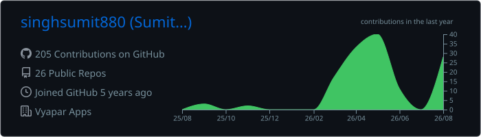
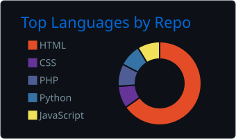
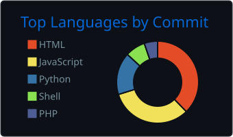

# Hi 👋, I'm Sumit Singh

### Senior QA Engineer @ Vyapar · SDET · Test Automation Engineer

**Building reliable software through automation & quality engineering.**

[Portfolio](https://singhsumit880.github.io/) ·
[LinkedIn](https://www.linkedin.com/in/singhsumit880) ·
[GitHub](https://github.com/singhsumit880)

## 👨‍💻 About Me

- 🧪 **5+ years** in QA, automation & quality engineering
- 🎭 Building **Playwright automation for Electron applications**
- 🏗️ Designing scalable **SDET frameworks & CI/CD pipelines**
- 🗄️ Building **database & QA productivity tools**
- 🤖 Exploring **AI-assisted QA**
- 📱 Android developer — **Kotlin · Jetpack Compose**
- 🔍 Passionate about **automation architecture, debugging & quality engineering**

> **Automate what is repetitive. Engineer what is scalable.**

 

---

## 🛠️ Tech Stack

**Automation:**  
Playwright · Selenium · Appium · JMeter

**Languages:**  
Python · Java · Kotlin · JavaScript · TypeScript

**DevOps:**  
Git · GitHub Actions · Jenkins · Docker

**Data:**  
SQLite · SQL · Excel

---

## 📊 GitHub

 

---

## 🚀 Featured Projects

🤖 [**QA Agent**](https://github.com/singhsumit880/qa_agent) ·
🗄️ [**DBCompare 2.0**](https://github.com/singhsumit880/DBCompare2.0) ·
📊 [**ExcelCompare**](https://github.com/singhsumit880/Excelcompare) ·
📱 [**Universal APK Generator**](https://github.com/singhsumit880/Universal-APK-Generator) ·
🌐 [**Portfolio**](https://singhsumit880.github.io/)

---

## 💡 Engineering Philosophy

**Automate → Validate → Analyze → Improve**

I build tools and automation that make software **faster to test, easier to debug, and safer to ship.**

---

### ⚡ Build. Automate. Validate. Improve.

